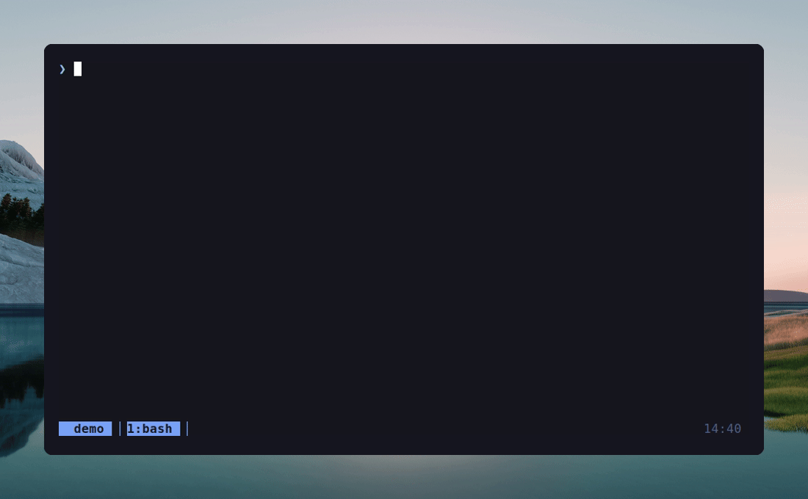

# tmux-config



## Install

```sh
cd ~/tmux-config        # wherever you cloned/placed this repo
./install.sh            # symlinks ~/.tmux.conf → ./tmux.conf
```

To remove:

```sh
./install.sh --uninstall   # restore the most recent backup
```

The installer backs up any existing `~/.tmux.conf` and
`~/.config/tmux/cheatsheet.txt` to `*.bak.<timestamp>` before touching them,
and reloads any running tmux server.

## The 30-second tour

**Prefix:** `Ctrl+Space` (primary) or `Ctrl+b` (secondary).

Inside tmux, press **`prefix ?`** for the full cheatsheet popup.

| What | Keys |
|---|---|
| Move between panes | `Alt+h/j/k/l` (no prefix) |
| Move between tabs | `Alt+←/→`, jump with `Alt+1..9` |
| Reorder tabs | `Ctrl+Shift+←/→` |
| Split panes | `prefix \|` (vertical) · `prefix -` (horizontal) |
| Resize panes | `prefix H/J/K/L` (repeatable) |
| Zoom pane | `prefix z` |
| Kill pane / window | `prefix x` / `prefix X` |
| New window (cwd) | `prefix c` |
| Last window | `prefix Tab` or `prefix Space` |
| Reload config | `prefix r` |
| Cheatsheet | `prefix ?` |
| All keybindings | `prefix /` |
| Sync panes (broadcast) | `prefix y` |

**Copy/paste — works everywhere:**

- Mouse drag → auto-copies to system clipboard
- Double-/triple-click → copy word/line
- Right-click → context menu (Paste / Copy Mode / Split / Kill);
  in copy-mode, right-click copies the selection
- `Ctrl+V` or `Shift+Insert` → paste from system clipboard (no prefix)
- Copy-mode (`prefix Esc` or `prefix [`): vim keys, `v` select, `y` yank,
  `Ctrl+u/d` half-page, `/` search

Clipboard auto-detects `wl-copy` (Wayland), `xclip` (X11), or `clip.exe` (WSL).

## Files

| File | Installed to |
|---|---|
| `tmux.conf` | `~/.tmux.conf` |
| `cheatsheet.txt` | `~/.config/tmux/cheatsheet.txt` |
| `install.sh` | — |
| `demo.tape` | — (run `vhs demo.tape` to regenerate `demo.gif`) |

## Customizing

Edit `tmux.conf` in the repo and run `prefix r` inside tmux. The installer
symlinks the file, so repo edits are live immediately.

The cheatsheet popup just runs `less ~/.config/tmux/cheatsheet.txt` — edit
that file to add your own notes. Press `q` inside the popup to close it.

## Uninstall

```sh
./install.sh --uninstall
```

Removes the symlinks and restores the most recent `*.bak.<timestamp>`
backup if one exists.
